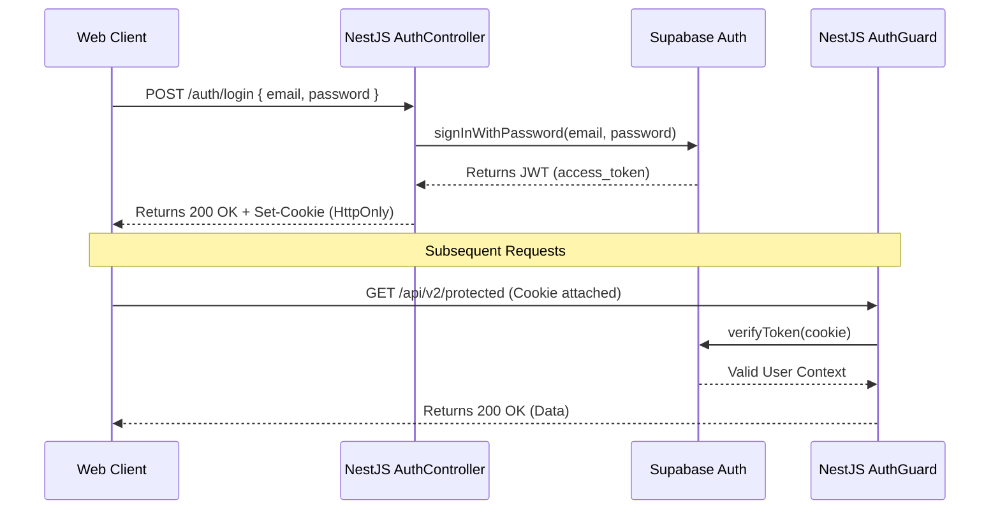

# Authentication Infrastructure

## Overview
Najmah AI Platform utilizes a hybrid authentication mechanism. It supports both traditional `Authorization: Bearer <token>` and `HttpOnly` Secure Cookies to verify sessions. This enables robust security for web-based clients by completely insulating the JWT from client-side JavaScript, mitigating XSS risks, while preserving backward compatibility for API-to-API integrations and existing mobile clients.

## Architecture & Flow

### 1. The Controller Layer (`AuthController`)
The native NestJS `AuthController` acts as an intermediary (BFF - Backend for Frontend) for the underlying identity provider (Supabase).
- **POST `/auth/login`**: Receives credentials, authenticates against Supabase.
- **POST `/auth/register`**: Registers the user and establishes a session.
- **POST `/auth/logout`**: Revokes the active session and clears cookies.
- **GET `/auth/me`**: Returns the current validated user context (roles/permissions).

On successful authentication, the server securely attaches the resulting JWT token using the `Set-Cookie` header.

### 2. Cookie Lifecycle
Cookies are configured via standard Environment variables, allowing zero-code updates based on the environment:
- `JWT_COOKIE_NAME`: (default: `najmah_token`) The name of the cookie.
- `JWT_COOKIE_SECURE`: Ensures the cookie is only sent over HTTPS (true for prod, false for dev).
- `JWT_COOKIE_SAMESITE`: Restricts cross-origin sending (default: `lax`).
- `JWT_COOKIE_MAX_AGE`: Absolute expiration of the cookie (default: 7 days).

### 3. The Validation Layer (`AuthGuard`)
The `AuthGuard` implements a cascading extraction pattern:
1. **Priority 1 (Bearer Token):** Parses `Authorization: Bearer <token>`.
2. **Priority 2 (HttpOnly Cookie):** Parses `request.cookies['najmah_token']`.

Once extracted, the token undergoes cryptographic verification via the Supabase Admin Client. If valid, the `RbacService` resolves the user's roles and permissions, attaching a finalized `UserContext` to `request.user`.

## Sequence Diagram (Login Flow)

## Security Considerations
1. **XSS Protection**: Since tokens are set as `HttpOnly`, malicious scripts executed in the browser cannot read them.
2. **CSRF Protection**: By setting `SameSite=Lax`, cookies are not sent during cross-site POST requests. A dedicated CSRF token mechanism (or stricter CORS) should complement this setup for modifying requests.
3. **Fail-Closed CORS**: We do not permit wildcard origins. Configured explicitly via `CORS_ALLOWED_ORIGINS` which dictates allowed cross-origin interactions.

## Migration Strategy
- **Sprint 9.5**: Introduce hybrid endpoints and cookie-support. Existing clients (passing Bearer headers) will see zero change.
- **Sprint 10**: Transition Lovable React Client to use the new `AuthController` endpoints. Strip Supabase-JS SDK from frontend components and remove `localStorage` token mechanisms.
- **Rollback**: To rollback Sprint 10's frontend changes, the frontend only needs to resume appending Bearer tokens. The backend will seamlessly honor them due to Priority 1 extraction logic.
