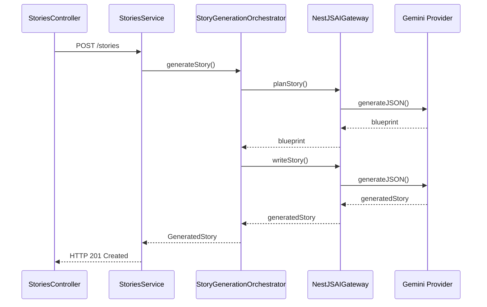
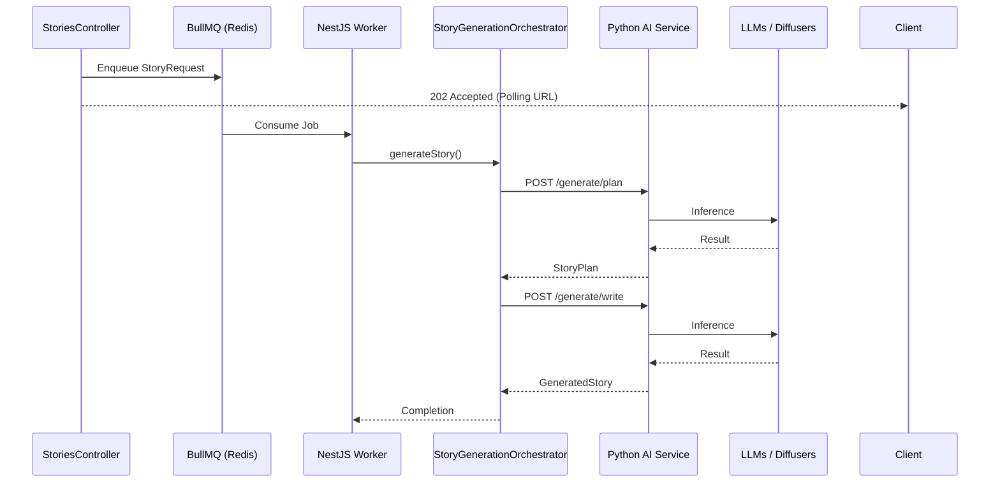

# Najmah AI Platform: Hybrid Backend Architecture

This document defines the architectural boundaries, contracts, and future roadmap for introducing a dedicated Python AI Microservice alongside our existing NestJS Business Backend.

## 1. AI Service Boundary
Our platform requires advanced, compute-heavy AI tasks that are better suited for the Python ecosystem (e.g., PyTorch, LangChain, specialized NLP/Vision pipelines) than our Node.js environment. However, the core business logic, API routing, and state lifecycle remain strictly in NestJS.

**Business Backend (NestJS):**
- Authentication & Authorization (RBAC)
- Multi-tenant data isolation
- Story lifecycle orchestration & state machine transitions
- User endpoints (`/stories`, `/children`, `/users`)
- Basic Generation (Story Context Builder, Planner, Writer, Validator)

**AI Backend (Future Python Service):**
- Agentic Workflows (e.g., iterative reasoning for story structures)
- Local Embedding generation & Retrieval-Augmented Generation (RAG)
- Scene Splitting & Image prompt generation (SDXL/Midjourney adapters)
- Character Bible management and consistency checking
- Text-to-Speech (TTS) Narration generation

## 2. AI Gateway Interface
To decouple our `StoryGenerationOrchestrator` from explicit AI pipeline implementations, we introduced the `IAIGateway` interface. 
Currently, the orchestrator delegates generation commands to `AI_GATEWAY`. 
In the interim (Phase 2), this resolves to `NestJSAIGateway`, which wraps the existing `StoryPlanner`, `StoryWriter`, and `StoryValidator`. 
In Phase 3, we can swap this for an `HttpAIGateway` that makes REST/gRPC calls to the Python service.

## 3. Communication Contracts
Contracts are centralized in `@najmah/shared` so both NextJS/NestJS and (via JSON schema generation) Python can consume them.

**StoryContext:**
```json
{
  "targetAge": 5,
  "language": "en",
  "readingLevel": "string",
  "theme": "string",
  "selGoal": "string",
  "pageCount": 0
}
```

**StoryPlan (Blueprint):**
```json
{
  "title": "string",
  "characters": [{ "name": "string", "role": "string", "description": "string" }],
  "conflict": "string",
  "resolution": "string",
  "selGoals": ["string"],
  "pageCount": 0
}
```

**GeneratedStory:**
```json
{
  "title": "string",
  "pages": [{ "pageNumber": 1, "text": "string" }],
  "metadata": { "theme": "string", "selGoal": "string" }
}
```

## 4. Future Project Structure
The repository will adopt a true monorepo structure:
```text
najmah-ai-platform/
├── backend-core/      # NestJS Business Logic & API
├── python-ai/         # Future FastAPI/PyTorch ML microservice
├── frontend/          # React/Vite Client
├── shared/            # Shared Contracts (DTOs, Interfaces)
│   ├── src/contracts/ai/
│   └── package.json
├── supabase/          # Database Migrations & Edge Functions
└── docs/              # Architecture & Release notes
```

## 5. Sequence Diagrams

### Current Architecture (NestJS Only)


### Future Architecture (Queue + Python Hybrid)


## 6. Migration Plan
- **Phase 1 (Current):** NestJS pipeline directly utilizing Gemini Provider.
- **Phase 2 (Completed):** AI Gateway pattern introduced. Contracts moved to `@najmah/shared`.
- **Phase 3:** Introduce BullMQ for async offline generation. Frontend transitions to polling/WebSocket updates.
- **Phase 4:** Initialize `python-ai/` folder with FastAPI. Implement basic router. Swap NestJS Gateway for HTTP Gateway to Python.
- **Phase 5:** Move Character Bible & Scene Splitting logic into Python.
- **Phase 6:** Integrate Image Generation adapters in Python.
- **Phase 7:** Integrate TTS (Narration) and final compilation into Python.
