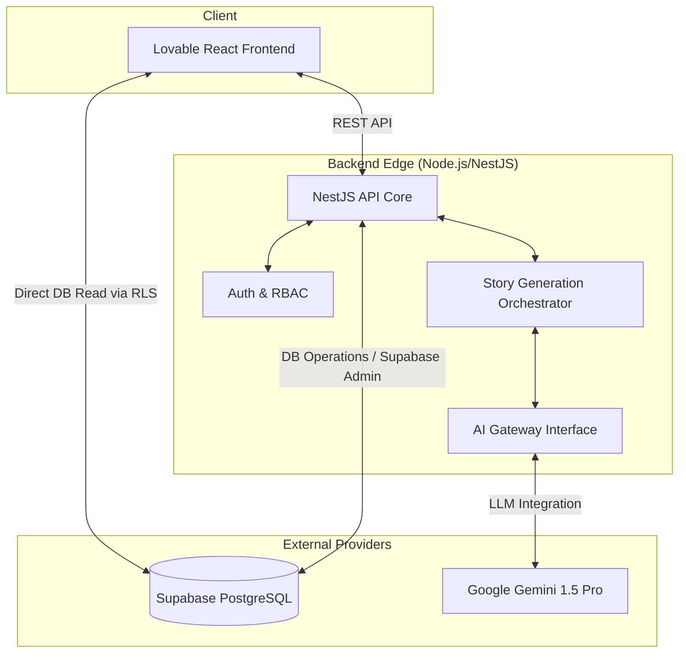

# Najmah AI Platform — Production Architecture

This document outlines the final production architecture for the Najmah AI Platform (MVP v1.0).

## 1. System Overview

Najmah AI Platform uses a decoupled, hybrid architecture to support rich frontend experiences and complex AI generation logic. 

## 2. Component Architecture

### 2.1. Frontend (Lovable React)
- **Framework:** React + Vite
- **State Management:** TanStack Query (React Query)
- **Routing:** React Router v7
- **Styling:** Tailwind CSS + shadcn/ui
- **Hosting Strategy:** Deployed as static assets to a CDN (e.g., Vercel, Netlify, or AWS CloudFront). The UI interacts with both the NestJS API and Supabase (for authentication/RLS direct reads).

### 2.2. Backend (NestJS Core)
- **Framework:** NestJS
- **Hosting Strategy:** Deployed in a containerized environment (e.g., Docker on AWS ECS, Google Cloud Run, or Render) scaling horizontally.
- **Responsibilities:**
  - Enforce RBAC (Role-Based Access Control).
  - Manage Story Generation Lifecycle via `StoryGenerationOrchestrator`.
  - Validate and orchestrate AI pipeline steps via the `AI Gateway`.
  - Perform secure operations using the Supabase Service Role Key.

### 2.3. Database & Authentication (Supabase)
- **Service:** Supabase (Managed PostgreSQL)
- **Responsibilities:**
  - Handle user authentication and session management.
  - Apply Row-Level Security (RLS) to enforce multi-tenant isolation.
  - Store application entities (`profiles`, `children`, `stories`, `story_requests`).

### 2.4. AI Provider (Google Gemini)
- **Service:** Google Gemini 1.5 Pro API
- **Responsibilities:**
  - Execute multi-step AI prompts for planning and writing stories aligned with SEL (Social Emotional Learning) goals.

## 3. Environment Separation

The architecture enforces strict separation across three environments:
1. **Development:** Local testing, mock AI providers, local or staging Supabase instances.
2. **Staging:** Mirror of production for end-to-end integration testing and QA. Uses a dedicated staging database and API keys.
3. **Production:** Live environment facing real users. Scaled and monitored. Requires strict CI/CD and deployment procedures.

## 4. Security & Isolation
- **Client Side:** Only the Supabase Anon Key is exposed. Direct data access relies entirely on RLS policies.
- **Server Side:** The Supabase Service Role Key is strictly isolated within the NestJS backend and NEVER exposed to the frontend.
- **API Protection:** Backend endpoints are guarded by `@UseGuards(AuthGuard, PermissionsGuard)` ensuring authorized operations only.
