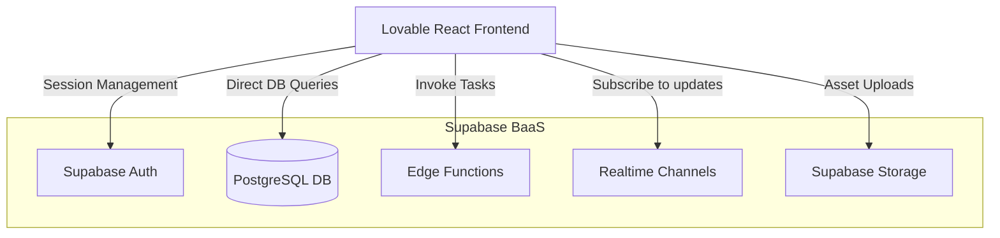
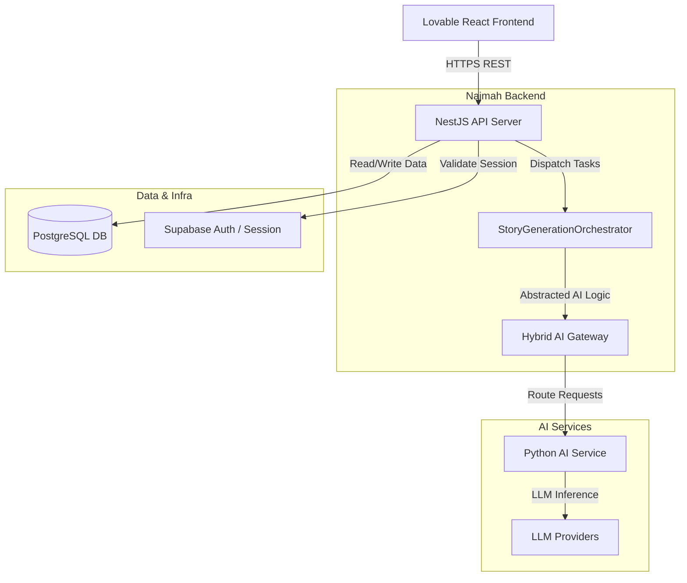

# Architecture Diagram

This document illustrates the migration of the frontend architecture.

## Current Architecture

Currently, the Lovable React frontend communicates directly with Supabase for almost all operations, bypassing the backend server entirely.

## Target Architecture

The target architecture enforces a strict boundary. The frontend will only communicate with the NestJS API, which securely orchestrates the required downstream services.

