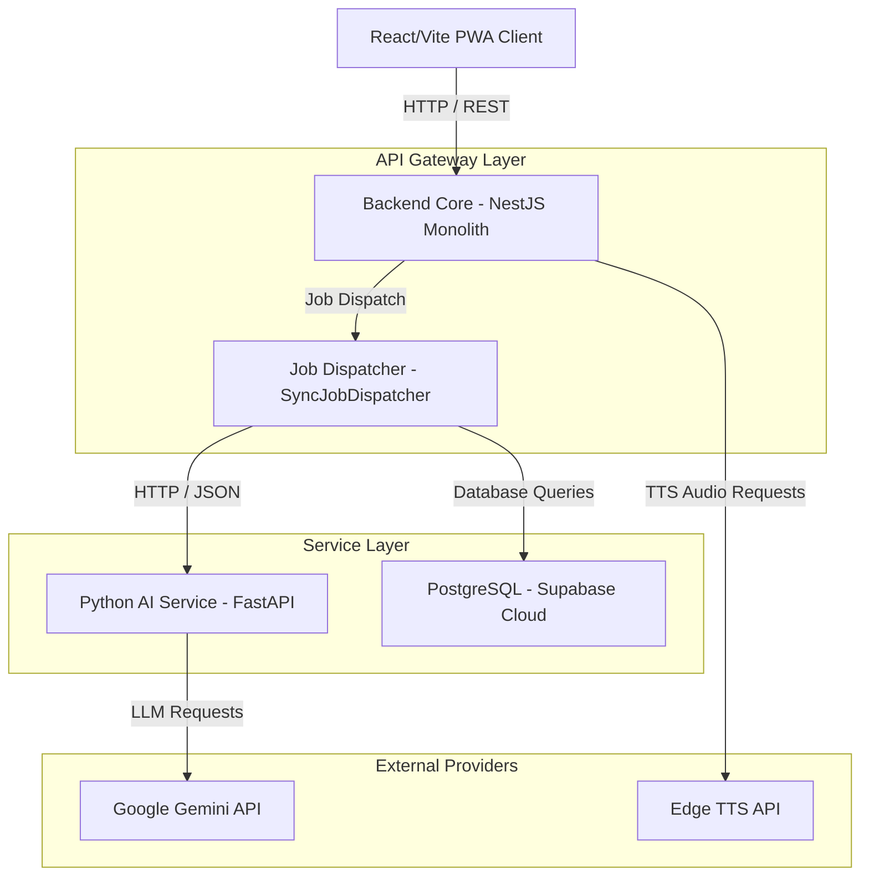

# Najmah v1.0 Final Architecture Audit (architecture-final-audit.md)

This report details the architectural status of the Najmah AI Platform before the official v1.0 production release.

---

## 1. System Topology

---

## 2. Core Modules Evaluation

### NestJS Monolithic Gateway
* **Modular Design:** Divided into domain modules (`auth`, `users`, `children`, `stories`, `media`, `ai`, `credits`, `subscriptions`, `billing`, `admin`).
* **Dependency Injection:** Enforces separation of concerns via providers and custom interceptors.
* **Error Handling:** Centralized through `HttpExceptionFilter`, catching all routing and service exceptions and mapping them to structured JSON payloads.
* **Configuration:** Centralized validation via Zod-based `validateEnv` and NestJS `ConfigService`.

### AI Gateway & Python AI Service
* **AI Pipelines:** Divided into Planner (blueprint generation), Writer (page rendering), and Validator (safety/quality checking).
* **Communication:** NestJS communicates with Python FastAPI using typed payload REST contracts. The Python service handles structural prompts validation and makes Gemini API requests.
* **Background Processing Preparation:** Completed in Sprint 17.3 by introducing a generic `JobDispatcher` and `JobHandler` layer.

---

## 3. Risk & Technical Debt Analysis
1. **Synchronous Execution:** Long-running generative AI pipelines block the active gateway connection thread, risking client timeouts. Moving to a distributed task queue (like BullMQ on Redis) is the primary recommendation before high-load production.
2. **Database Sockets:** Highly concurrent writes to transaction logs can saturate the PostgreSQL connection limits.
