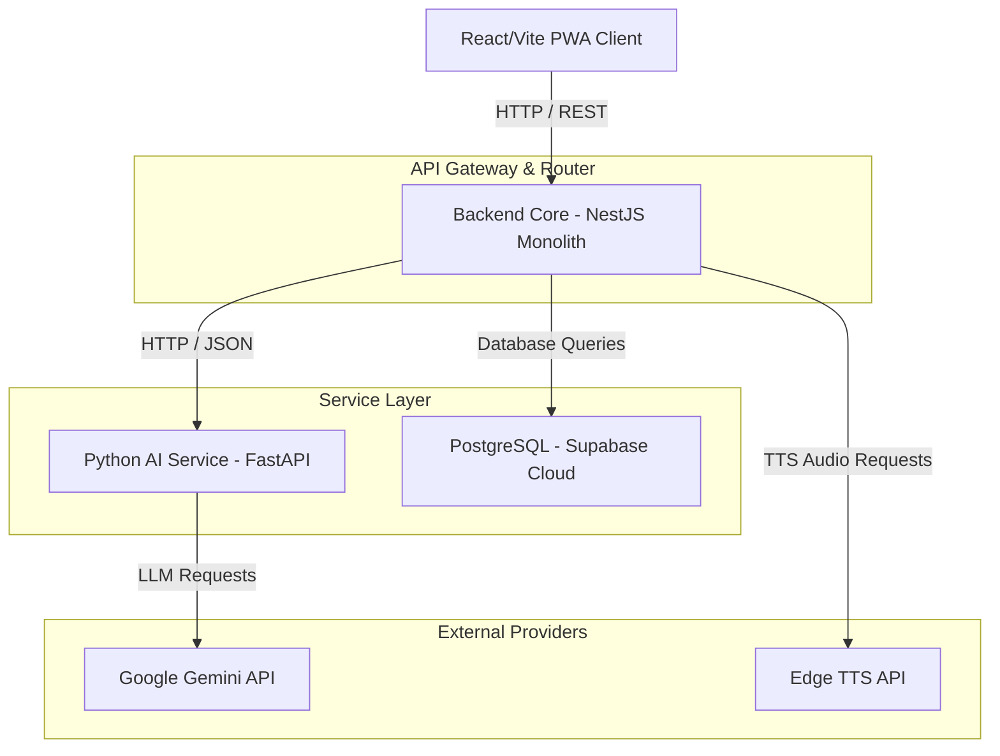

# Current Architecture Assessment (phase10-enterprise-scaling-assessment.md)

This document provides a comprehensive scaling assessment of the Najmah AI Platform, identifying architectural limitations, risk factors, and boundary opportunities for enterprise-grade growth.

---

## 1. Current Architecture Diagram

---

## 2. Component Scaling Analysis

### Backend Gateway (NestJS)
* **Statelessness:** The NestJS monolith is fully stateless. It stores no sessions in memory; authentication is JWT-based, and media outputs are direct cloud uploads.
* **Ready for Horizontal Scaling:** Yes. Multiple instances of `backend-core` can run behind a load balancer without data syncing conflicts.
* **Limitations:** CPU-bound crypto operations (AES encryption) and PDF rendering can saturate the main thread if request volume grows abnormally.

### Database Layer (Supabase / PostgreSQL)
* **Write Saturation:** Highly concurrent writes to `usage_events`, `ai_audit_logs`, and story updates can exhaust the database connection limit.
* **Query Scalability:** Suboptimal JOIN queries on large log tables will cause locking issues.
* **Future Options:** Introduce connection pooling (e.g. Supabase PgBouncer/Supavisor), read replicas for analytics/admin reads, and logical partitioning on transaction logs.

### AI Service (FastAPI)
* **Workload Characteristics:** High latency due to Gemini API response times (ranging from 3s to 12s).
* **Limitations:** The synchronous/blocking calls (or holding connections open in the gateway) exhaust server connection pools.
* **Future Options:** Decouple story planning and writing via async message brokers (Redis/BullMQ) and run workers in parallel.

---

## 3. Service Boundary Review

The following modules represent candidates for future microservice extraction to isolate compute loads:
1. **Media Generator (Candidate #1):** Isolates TTS audio stitching and image downloads, which are highly resource-heavy.
2. **AI Writer (Candidate #2):** Isolates prompt composition, validation loops, and LLM retry execution pipelines.
3. **Commerce & Subscriptions (Candidate #3):** Standardizes payment logs and plans limits auditing safely.

---

## 4. High Availability & Disaster Recovery
* **Deployment Redundancy:** Run a minimum of 2 container replicas per service across different availability zones.
* **Health-Based Routing:** Configure load balancers to route traffic away from containers that fail readiness checks.
* **Archival Storage:** Implement storage policies to move files older than 30 days to low-cost archival storage classes.

---

## 5. Security & Isolation Review
* **Tenant Isolation:** Tenant checks are handled natively in Supabase using Row-Level Security (RLS).
* **API Security:** Endpoints must implement rate-limiting per trace ID to avoid denial-of-service vectors.
