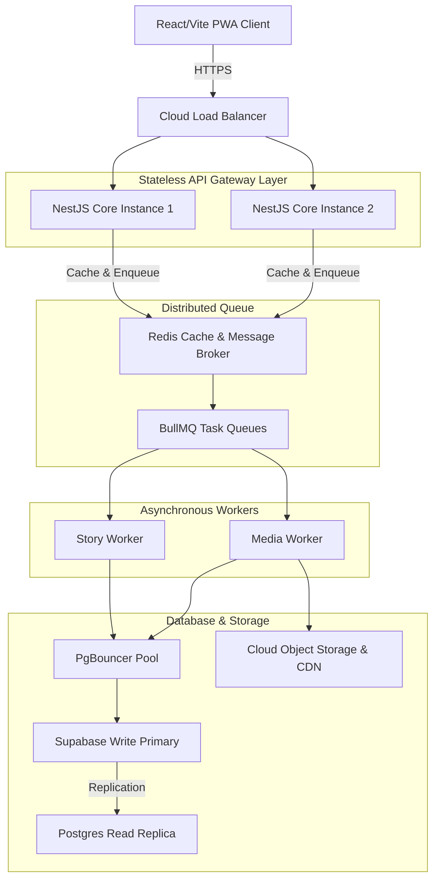

# Target Enterprise Architecture Proposal (phase10-target-architecture.md)

This document proposes the target topology evolution for the Najmah AI Platform to support high throughput, low latency, and fault isolation.

---

## 1. Target Enterprise Topology

---

## 2. Infrastructure Specifications

### Load Balancing & Stateful Isolation
* **Layer 7 Load Balancer:** Routes public HTTP traffic across stateless NestJS instances.
* **Health-Check Probes:** Dynamically evaluates `/health/ready` liveness to detach unhealthy backend instances automatically.

### Asynchronous Event Loop (BullMQ & Redis)
* **Message Broker:** Redis is used as the event state store.
* **Worker Pools:** Long-running generative AI pipelines (planning, writing, and illustration downloads) are enqueued to a background task queue (`BullMQ`). The stateless backend returns a `202 Accepted` status with a task tracking ID immediately, preventing client HTTP request timeouts.

### Database Scaling
* **PgBouncer Connection Pooler:** Manages active connections to PostgreSQL primary write instances, reducing execution times and overhead.
* **Read-Replicas:** Offloads read queries from the primary node to read replicas, improving database write throughput.
* **Horizontal Storage:** All generated story PDFs and TTS audios are uploaded to S3-compatible cloud object storage classes and served via a global CDN edge.
