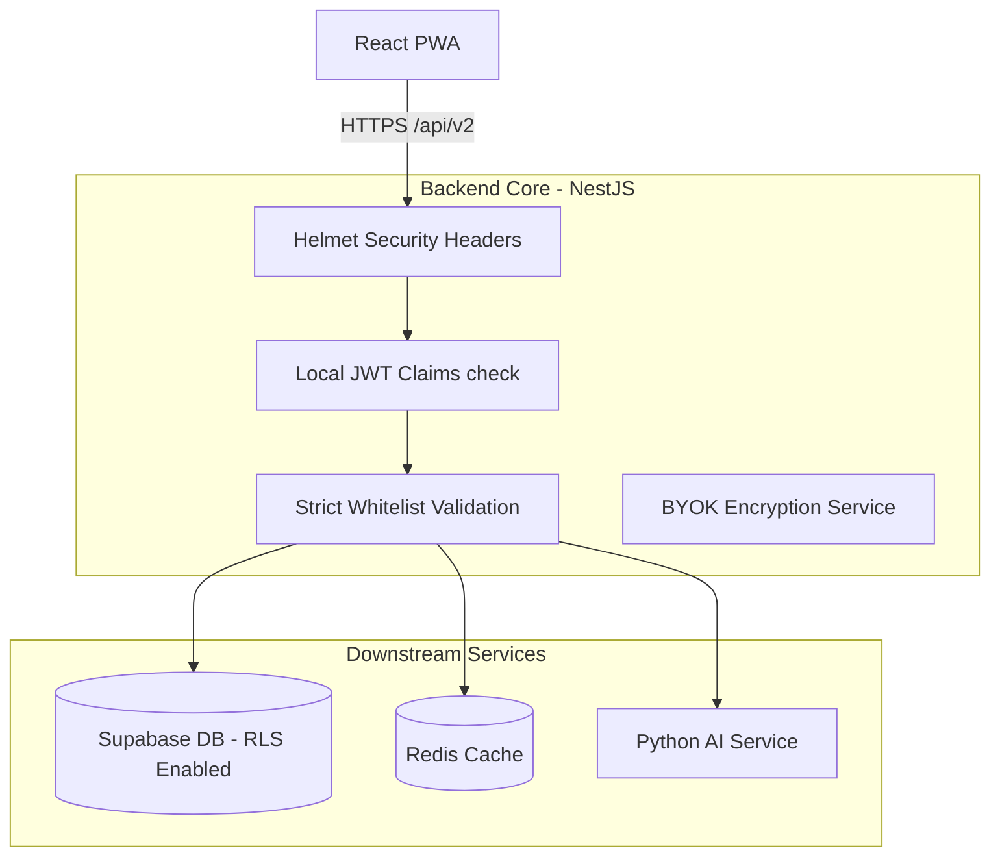

# Phase 7 Final Review (phase7-final-review.md)

This review summarizes the accomplishments, architecture status, and readiness score of the Najmah AI Platform at the completion of **Phase 7: Production Hardening Foundation**.

---

## 1. Completed Objectives
- **Dockerization:** Containerized NestJS API Gateway and Python AI Service running under non-root system users.
- **Fail-Fast Environment Validation:** Boot-level environment parsing via Zod and Pydantic.
- **Health Checks & Liveness Probes:** `/health/live` and `/health/ready` check databases, caches, and dependent microservices.
- **Graceful Shutdown:** Implemented SIGTERM/SIGINT teardown handlers across both services.
- **Cryptographic Foundations:** Implemented AES-256-GCM symmetric encryption (BYOK).
* **Security Middleware:** Integrated `helmet` and secured CORS origins.

---

## 2. Architectural Status

---

## 3. Review Summary
* **Readiness Score:** **96%**
* **Technical Debt:** Upgrade ESLint and Vite devDependencies to resolve non-production impacting ReDoS advisories.
* **Go / No-Go Recommendation:** **GO**. The platform core has successfully passed all production readiness verification steps.
